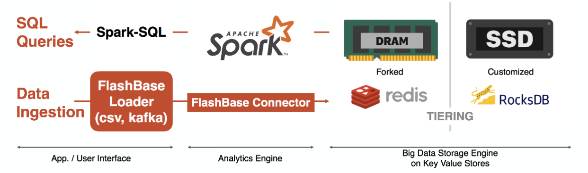

# 1. FlashBase is

A distributed in-memory DBMS for real-time big data analytics

- Realtime ingestion and analytics for large scale data
- Advantages in random small data accesses based on DRAM/SSD resident KV Store
- Optimized for time series data and geospatial data

# 2. Architecture

Spark with Redis/Rocksdb key value stores 

- No I/O bottleneck due to redis in DRAM and rocksdb in SSDs due to the small sized key/value I/O and DRAM/SSDs’ short latency (~200us)
- Filter predicates push down to redis and only associated partitions are chosen to be scanned

# 3. Features

- Ingestion performance (500,000 records/sec/node)
- Extreme partitioning (up-to 2 billion partitions for a single node)
- Real-time query performance by using fine-grained partitions and filter acceleration (vector processing by exploiting XEON SIMD instructions)
- Column-store / row-store support
- DRAM - SSD - HDD Tiering •High  compression  ratio  and  compression  speed  (Gzip  level  compression ratio w/ LZ4 level speed)
- Low Write Amplification for SSD life time
