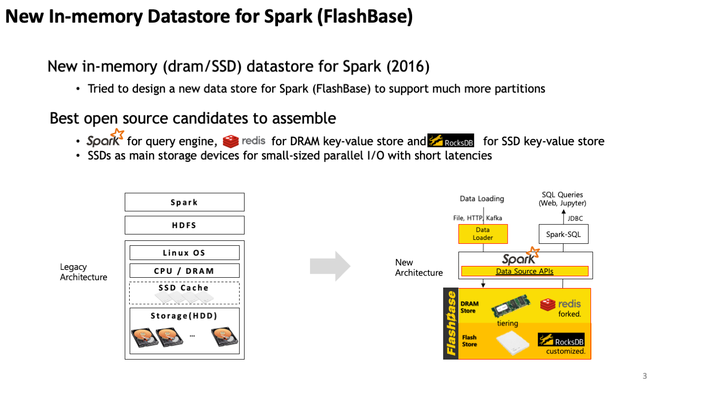
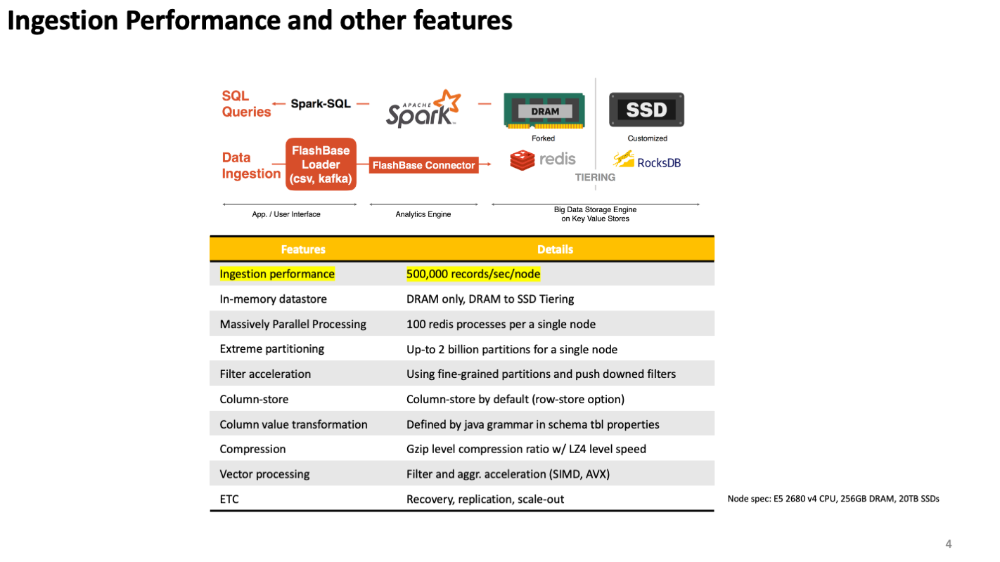
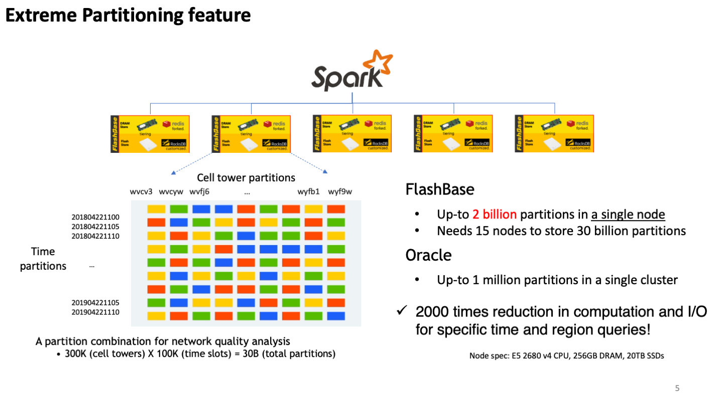
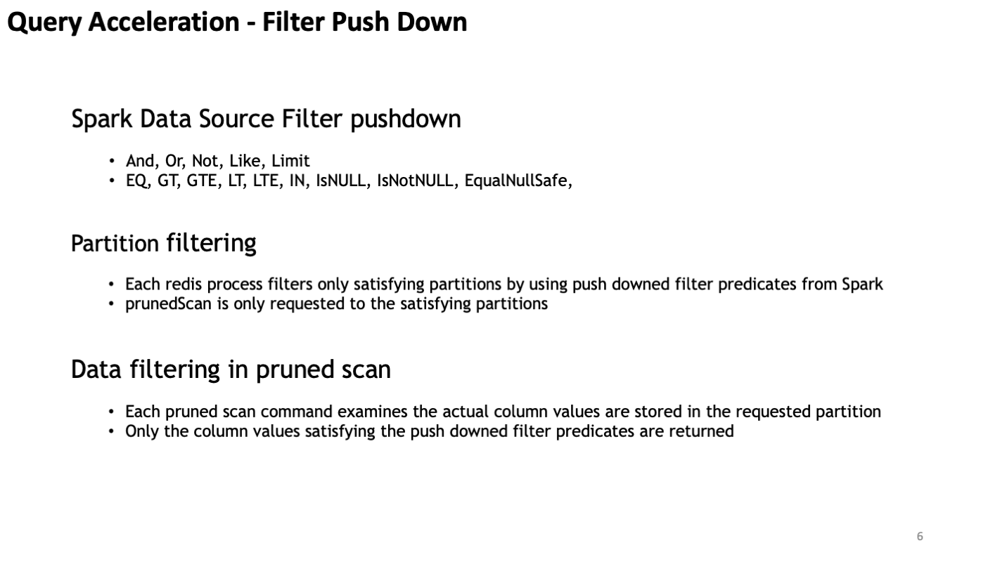
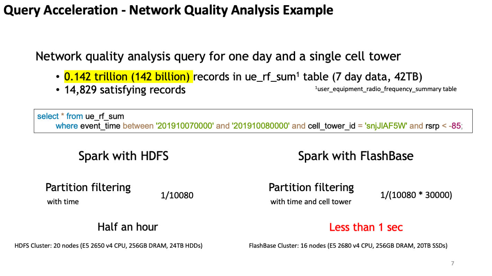
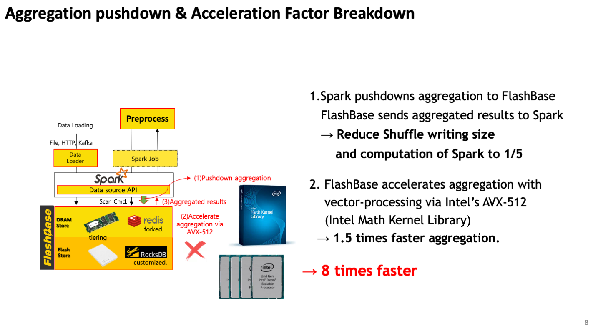
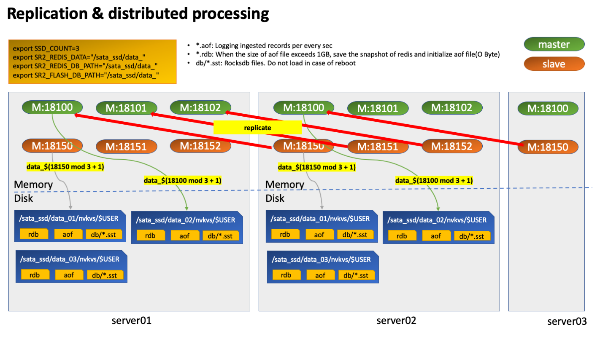
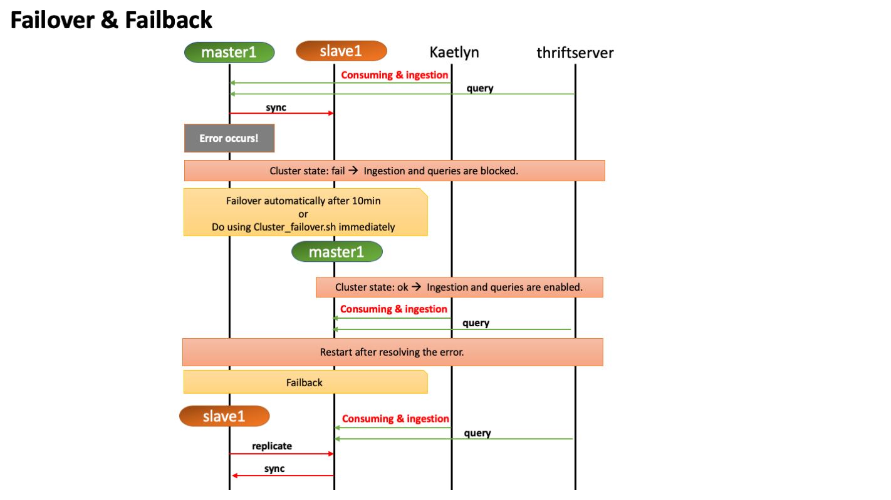

Tutorial


# 1. About Lightning DB

### Architecture & key features








### Replication & failover/failback




# 2. LTCLI

[Installation](install-ltcli.md)

[Command Line](command-line-interface.md)

# 3. Ingestion

### load.sh
'tsr2-tools'를 이용한 적재로 '-s' option으로 delimiter 설정 후 사용

```
#!/bin/bash
if [ $# -ne 2 ];
then
    echo "Usage: load_data.sh data-directory json-file"
    echo "(e.g.: load_data.sh ./data/split ./json/106.json)"
    echo "Warning: delimiter is '|'"
    exit
fi
tsr2-tools insert java_options "-Xms1g -Xmx32g" -d $1 -s "|" -t $2 -p 40 -c 1 -i
```

- 사용방법
```
[ltdb@d205 ~/tsr2-test]$ cat ./json/cell_nvkvs.json    // json file 작성.
{
"endpoint" : "192.168.111.205:18600",
"id" :"9999",
"columns" : 219,
"partitions" : [
216, 218, 3, 4
],
"rowStore" : true             // 적재하는 클러스터에서 'row-store-enabled'가 동일하게 'true'인지 확인 필요. 반대의 경우 둘다 'false'로 설정하면 됨.
}

[ltdb@d205 ~/tsr2-test]$ ls -alh ./test_data_one/                   // 적재할 데이터 확인. dir 및 file path 모두 가능함.
total 8.7M
drwxrwxr-x. 2 ltdb ltdb 50 2020-06-18 08:58:44 ./
drwxrwxr-x. 7 ltdb ltdb 84 2020-06-18 08:58:28 ../
-rw-rw-r--. 1 ltdb ltdb 8.7M 2020-06-18 08:58:44 ANALYSIS_CELL_ELG_20160711055950.dat

[ltdb@d205 ~/tsr2-test]$ load.sh                                        // 그냥 'load.sh'를 입력하면  args 정보가 표시됨.
Usage: load_data.sh data-directory json-file
(e.g.: load_data.sh ./data/split ./json/106.json)
Warning: delimiter is '|'
[ltdb@d205 ~/tsr2-test]$ load.sh ./test_data_one/ ./json/cell_nvkvs.json
/home/ltdb/tsr2-test/sbin/load.sh: line 9: tsr2-tools: command not found             // cluster 지정이 되지 않아 실행이 안되는 것으로 'cfc'를 사용하여 cluster 를 지정함

[ltdb@d205 ~/tsr2-test]$ cfc 6
[C:6][ltdb@d205 ~/tsr2-test]$ load.sh ./test_data_one/ ./json/cell_nvkvs.json       // 적재 시작.
SLF4J: Class path contains multiple SLF4J bindings.
SLF4J: Found binding in [jar:file:/home/ltdb/tsr2/cluster_6/tsr2-assembly-1.0.0-SNAPSHOT/lib/logback-classic-1.2.3.jar!/org/slf4j/impl/StaticLoggerBinder.class]
```

### kafka & kafkacat & tsr2-kaetlyn

- zookeeper/kafka

zookeeper 및 kafka broker 설치가 선행되어야 함 ==> [Kafka&Kaetlyn 설치](kaetlyn.md) 참고

사용하는 topic은 크게 아래와 같이 3가지로 나누어짐

	1. 데이터 적재를 위한 topic
		- table간 dependency가 없도록 table별로 나눠서 적재 필요
	2. error topic
		- 'tsr2-kaetlyn edit'을 통해 'KAFKA_ERROR_REPORT_TOPIC_NAME=topic-error' 로 설정
		- consuming 단계에서 적재 실패 시 error topic으로 에러 내용을 넣어서 적재 client가 확인할 수 있도록 함
	3. result topic(optional)
		- consuming 후 적재 결과를 정의된 protocol에 맞게 적재 app에 전달할 수 있음


- kafka consumer

[Kafka&Kaetlyn 설치](kaetlyn.md)에서 가이드하고 있는 kaetlyn consumer를 사용하여 consumer를 설정.

'tsr2-kaetlyn edit'을 통해 consumer 설정이 필요함

기본적으로 '수정 필요'로 코멘트된 부분은 검토 및 수정이 필요함
```
#!/bin/bash
###############################################################################
# Common variables
SPARK_CONF=${SPARK_CONF:-$SPARK_HOME/conf}
SPARK_BIN=${SPARK_BIN:-$SPARK_HOME/bin}
SPARK_SBIN=${SPARK_SBIN:-$SPARK_HOME/sbin}
SPARK_LOG=${SPARK_LOG:-$SPARK_HOME/logs}

SPARK_METRICS=${SPARK_CONF}/metrics.properties
SPARK_UI_PORT=${SPARK_UI_PORT:-14040}

KAFKA_SERVER=localhost:9092

###############################################################################
# Properties for Consumer
DRIVER_MEMORY=1g                               // 수정 필요

EXECUTOR_MEMORY=1g                               // 수정 필요
EXECUTORS=12                               // 수정 필요
EXECUTOR_CORES=12                               // 수정 필요

#JSON_PATH=~/Flashbase/flashbase-benchmark/json/load_no_skew
JSON_PATH=/home/ltdb/tsr2-test/json                               // 수정 필요, json file 업데이트 시 kaetlyn 재시작 필요!
#HIVE_METASTORE_URI=thrift://localhost:9083
HIVE_METASTORE_URI=''                               // 수정 필요
KAFKA_CONSUMER_GROUP_ID=nvkvs_redis_connector                               // 수정 필요
KAFKA_CONSUMING_TOPIC_LIST=nvkvs3                               // 수정 필요
JOB_GENERATION_PERIOD=1
MAX_RATE_PER_PARTITION=20000
KAFKA_ERROR_REPORT_TOPIC_NAME=topic-error
TEST_MODE=false
EXCUTOR_LOCALITY=false
```

- kafka producer
기본적으로 kafka producing은 아래와 같은 방법으로 할 수 있음

```
kafka-console-producer.sh --broker-list localhost:9092 --topic {topic name} < {적재할 filename}
```

하지만, kaetlyn 적재를 위해서는 메시지에 아래 헤더 정보가 포함되어야 한다.

- TABLE_ID
- SEPARATOR


따라서 kafkacat이라는 tool을 통해 헤더 정보와 함께 producing을 해야 한다.(https://docs.confluent.io/3.3.0/app-development/kafkacat-usage.html# 참고)
```
c++ compiler 설치

$yum install gcc-c++


$ git clone https://github.com/edenhill/librdkafka


$ cd librdkafka

$ ./configure

$ make

$ sudo make install


 /usr/local/lib 로 이동해주어 다음 명령어 실행한다.


$ git clone https://github.com/edenhill/kafkacat


$ cd kafkacat

$ ./configure

$ make

$ sudo make install


Lib 파일을 찾을 수 없다면

$ ldd kafkacat


다음의 파일을 만들고 아래를 추가 /etc/ld.so.conf.d/usrlocal.conf

Contents:

/usr/local/lib


저장 후 아래 명령어 실행

$ ldconfig -v


$kafkacat

Kafkacat에 대한 명령어가 나오면 성공
```


kafkacat이 정상 설치되었으면 아래와 같이 producing이 가능함

file 하나만 적재할 경우
```
kafkacat -b localhost:9092 -t {topic name} -T -P -H TABLE_ID='{table id}' -H  SEPARATOR='|' -l {적재할 filename}
```

2. dir에 있는 모든 파일을 적재할 때에는 해당 dir로 이동한 후에,
```
ls | xargs -n 1 kafkacat -q -b localhost:9092 -t {topic name} -P -H TABLE_ID='{table id}' -H  SEPARATOR='|' -l
```

** 기본적인 가이드는 [Kafka&Kaetlyn 설치](kaetlyn.md)에 있으므로 개념 이해를 위해서는 이 페이지를 참고하면 되지만 좀 더 편리하게 사용하기 위해 kafka-utils.sh를 제공하고 있어 운영 시에는  kafka-utils.sh를 사용하면 됨.

'kafka-utils.sh'는 각 클러스터별 sbin에 있으므로, 'cfc'로 cluster 설정 후 사용이 가능함.
```
[C:6][ltdb@d205 ~]$ which kafka-utils.sh
~/tsr2/cluster_6/tsr2-assembly-1.0.0-SNAPSHOT/sbin/kafka-utils.sh
```

아래와 같이 'CONSUMER_GROUP_ID'가 지정되어 있지 않으면 실행이 되지 않으므로,
```
[C:6][ltdb@d205 ~]$ kafka-utils.sh help
Please, set $CONSUMER_GROUP_ID first.
```

아래와 같이 'kafka-utils.sh'를 열어서 수정을 해야 함.
```
#!/bin/bash

CONSUMER_GROUP_ID='nvkvs_redis_connector'  // 수정 필요
KAFKA_SERVER=localhost:9092
ZOOKEEPER_SERVER=localhost:2181...
```

'help'를 통해 가능한 커맨드를 확인할 수 있음.
```
[C:6][ltdb@d205 ~/kafka/config]$ kafka-utils.sh help
kafka-utils.sh offset-check
kafka-utils.sh offset-monitor
kafka-utils.sh offset-earliest topic_name
kafka-utils.sh offset-latest topic_name
kafka-utils.sh offset-move topic_name 10000
kafka-utils.sh error-monitor error_topic_name
kafka-utils.sh consumer-list
kafka-utils.sh topic-check topic_name
kafka-utils.sh topic-create topic_name 10
kafka-utils.sh topic-delete topic_name
kafka-utils.sh topic-config-check topic_name
kafka-utils.sh topic-config-set topic_name config_name config_value
kafka-utils.sh topic-config-remove topic_name config_name
kafka-utils.sh topic-list
kafka-utils.sh message-earliest topic_name
kafka-utils.sh message-latest topic_name
```


command에 args가 필요한 경우, args없이 입력하면 아래와 같이 가이드 문구가 나옴.
```
[C:6][ltdb@d205 ~/kafka/config]$ kafka-utils.sh offset-move 
Please, specify topic name & the size of moving offset (ex) kafka-utils.sh offset-move my-topic 100
[C:6][ltdb@d205 ~/kafka/config]$ kafka-utils.sh topic-create
Please, specify topic name and its partition count. (ex) kafka-utils.sh topic-create topic-new 10
[C:6][ltdb@d205 ~/kafka/config]$
```

사용 예,
```
[C:6][ltdb@d205 ~]$ kafka-utils.sh message-earliest nvkvs3
20160711055950|ELG|2635055200|34317|5|6091|1|25|0|11|0|100.0|0.0|0|2846|3|33|0|5|0|-1000|0.0|0.0|94932|1027|0|176|35.2|40|0|7818000000|109816071|10|0|6000000.0|164843|2.75|0|2592|6000000|0.04|1288488|1303|1338|0|530|1|88.33|0|721|67948|428|0|1|108|108.0|108|0|0.0|0|0|0|-1000|1|1|100.0|62|39.0|62.9|23.0|37.1|0|0|0|0|29|10|-7022851.0|59998.0|-117.05|-6865443.5|59998.0|-114.43|4|198060.0|59998.0|22.5|3.3|0|1|5.82|3|1.94||0|0|0|0|0|0|0|0|4|0|0|0|15|14|231|140|0|0|0|0|0|0|0|0|4|0|0|0|15|13|174|110|1|0|0|0|0|0|0|0|0|0|0|0|0|0|1|0|0|0|0|0|0|0|1|0|0|0|0|0|0|0|0|0|0.0|0.0|0.0|0.0|0.0|0.0|570.0|0.0|3.0|0.0|0.0|0.0|0.0|2.0|3.0|3.0|0.0|15.73|0.0|0.0|0.0|0.0|0.0|12.0|22.0|68.0|83.0|339.0|205.0|144.0|54.0|38.0|12.0|0.0|0.0|0.0|0.0|0.0|0.0|100.0|50.55|1:22,2:7|1.0|||||1:1,17:1,23:1|13.67|0|0|0.0|0.0|-1000||-1000||-1000|11|2|05
Processed a total of 1 messages


[C:6][ltdb@d205 ~]$ kafka-utils.sh topic-list
__consumer_offsets
nvkvs3
topic-error
topic_name


[C:6][ltdb@d205 ~]$ kafka-utils.sh topic-create ksh 18
Created topic ksh.


[C:6][ltdb@d205 ~]$ kafka-utils.sh topic-check  ksh
Topic:ksh	PartitionCount:18	ReplicationFactor:2	Configs:
	Topic: ksh	Partition: 0	Leader: 1	Replicas: 1,3	Isr: 1,3
	Topic: ksh	Partition: 1	Leader: 2	Replicas: 2,1	Isr: 2,1
	Topic: ksh	Partition: 2	Leader: 3	Replicas: 3,2	Isr: 3,2
	Topic: ksh	Partition: 3	Leader: 1	Replicas: 1,2	Isr: 1,2
	Topic: ksh	Partition: 4	Leader: 2	Replicas: 2,3	Isr: 2,3
	Topic: ksh	Partition: 5	Leader: 3	Replicas: 3,1	Isr: 3,1
	Topic: ksh	Partition: 6	Leader: 1	Replicas: 1,3	Isr: 1,3
	Topic: ksh	Partition: 7	Leader: 2	Replicas: 2,1	Isr: 2,1
	Topic: ksh	Partition: 8	Leader: 3	Replicas: 3,2	Isr: 3,2
	Topic: ksh	Partition: 9	Leader: 1	Replicas: 1,2	Isr: 1,2
	Topic: ksh	Partition: 10	Leader: 2	Replicas: 2,3	Isr: 2,3
	Topic: ksh	Partition: 11	Leader: 3	Replicas: 3,1	Isr: 3,1
	Topic: ksh	Partition: 12	Leader: 1	Replicas: 1,3	Isr: 1,3
	Topic: ksh	Partition: 13	Leader: 2	Replicas: 2,1	Isr: 2,1
	Topic: ksh	Partition: 14	Leader: 3	Replicas: 3,2	Isr: 3,2
	Topic: ksh	Partition: 15	Leader: 1	Replicas: 1,2	Isr: 1,2
	Topic: ksh	Partition: 16	Leader: 2	Replicas: 2,3	Isr: 2,3
	Topic: ksh	Partition: 17	Leader: 3	Replicas: 3,1	Isr: 3,1
```


# 4. Query

### thriftserver
thriftserver를 사용하여 질의를 수행할 수 있으며, hive-metastore를 사용해서 메타정보를 관리할 수 있습니다.

각 cluster에 thriftserver 가 있으며, 특정 클러스터에서 띄울 수 있습니다.
```
> cfc 6
> which thriftserver
~/tsr2/cluster_6/tsr2-assembly-1.0.0-SNAPSHOT/sbin/thriftserver
```

실행 전, 'thriftserver edit'을 통해 설정값을 변경합니다.

```
#!/bin/bash
###############################################################################
# Common variables
SPARK_CONF=${SPARK_CONF:-$SPARK_HOME/conf}
SPARK_BIN=${SPARK_BIN:-$SPARK_HOME/bin}
SPARK_SBIN=${SPARK_SBIN:-$SPARK_HOME/sbin}
SPARK_LOG=${SPARK_LOG:-$SPARK_HOME/logs}

SPARK_METRICS=${SPARK_CONF}/metrics.properties
SPARK_UI_PORT=${SPARK_UI_PORT:-14050}
EXECUTERS=12       // 수정 필요
EXECUTER_CORES=32     // 수정필요

HIVE_METASTORE_URL=''
HIVE_HOST=${HIVE_HOST:-localhost}
HIVE_PORT=${HIVE_PORT:-13000}

COMMON_CLASSPATH=$(find $SR2_LIB -name 'tsr2*' -o -name 'spark-r2*' -o -name '*jedis*' -o -name 'commons*' -o -name 'jdeferred*' \
-o -name 'geospark*' -o -name 'gt-*' | tr '\n' ':')

###############################################################################
# Driver
DRIVER_MEMORY=6g      // 수정 필요
DRIVER_CLASSPATH=$COMMON_CLASSPATH

###############################################################################
# Execute
EXECUTOR_MEMORY=2g      // 수정 필요
EXECUTOR_CLASSPATH=$COMMON_CLASSPATH

###############################################################################
# Thrift Server logs
EVENT_LOG_ENABLED=false
EVENT_LOG_DIR=/nvdrive0/thriftserver-event-logs
EVENT_LOG_ROLLING_DIR=/nvdrive0/thriftserver-event-logs-rolling
EVENT_LOG_SAVE_MIN=60
EXTRACTED_EVENT_LOG_SAVE_DAY=5
SPARK_LOG_SAVE_MIN=2000
##############

```

- start 방법
```
thriftserver start
```

- stop 방법
```
thriftserver stop
```

- yarn application 확인
```
> yarn application -list
20/06/25 17:04:35 INFO client.RMProxy: Connecting to ResourceManager at d205/192.168.111.205:18032
Total number of applications (application-types: [] and states: [SUBMITTED, ACCEPTED, RUNNING]):1
                Application-Id	    Application-Name	    Application-Type	      User	     Queue	             State	       Final-State	       Progress	                       Tracking-URL
application_1592880218288_0002	 ThriftServer_d205_6	               SPARK	      ltdb	   default	           RUNNING	         UNDEFINED	            10%	                  http://d205:14050
```
- table properties 확인
```
0: jdbc:hive2://0.0.0.0:13000> show tables;
+-----------+-----------------------------------------------+--------------+--+
| database | tableName | isTemporary |
+-----------+-----------------------------------------------+--------------+--+
| default | aua_adong_cd | false |
| default | aua_aom_log | false |
| default | aua_cell_by10sec_sum | false |
| default | aua_cell_by5min_sum | false |
| default | aua_cell_cfg_inf | false |
| default | aua_enb_nsn_ho_log | false |
| default | aua_enb_nsn_rrc_log | false |
| default | aua_enb_ss_csl_log | false |
| default | aua_ra_cscore_area_5min_sum | false |
| default | aua_ue_rf_sum | false |
| | aua_aom_log_6fbb17bb9718a46306ec7a9766464813 | true |
+-----------+-----------------------------------------------+--------------+--+
11 rows selected (0.045 seconds)

0: jdbc:hive2://0.0.0.0:13000> show tblproperties aua_ue_rf_sum;
+---------------------------------------------+-------------------------------------------------------------------------------------------------+--+
| key | value |
+---------------------------------------------+-------------------------------------------------------------------------------------------------+--+
| transient_lastDdlTime | 1581872791 |
| fb.load.kafka.bootstrap.servers | 90.90.200.182:9092,90.90.200.183:9092,90.90.200.184:9092,90.90.200.185:9092,90.90.200.186:9092 |
| fb.transformation.column.add.IMSI_KEY | ${IMSI_NO}.length() >= 2 && ${IMSI_NO}.substring(0, 2).equals("T1") ? "T1" : "O" |
| fb.transformation.column.add.IMSI_HASH_KEY | fnvHash(${IMSI_NO}, 5) |
| fb.load.kafka.producer.compression.type | zstd |
| fb.transformation.column.add.EVENT_TIME | ${EVT_DTM}.length() < 12 ? "000000000000" : ${EVT_DTM}.substring(0, 11).concat("0") |
| fb.load.kafka.topic.name | topic-tango-dev |
| Comment | 단말별 분석 결과 |
| fb.load.kafka.producer.max.request.size | 1048576 |
+---------------------------------------------+-------------------------------------------------------------------------------------------------+--+
9 rows selected (0.1 seconds)
0: jdbc:hive2://0.0.0.0:13000>

0: jdbc:hive2://0.0.0.0:13000> show create table aua_ue_rf_sum;
+-----------------------------------------------------------------------------------------------------------------------------------------------------------------------------------------------------------------------------------------------------------------------------------------------------------------------------------------------------------------------------------------------------------------------------------------------------------------------------------------------------------------------------------------------------------------------------------------------------------------------------------------------------------------------------------------------------------------------------------------------------------------------------------------------------------------------------------------------------------------------------------------------------------------------------------------------------------------------------------------------------------------------------------------------------------------------------------------------------------------------------------------------------------------------------------------------------------------------------------------------------------------------------------------------------------------------------------+--+
| createtab_stmt |
+-----------------------------------------------------------------------------------------------------------------------------------------------------------------------------------------------------------------------------------------------------------------------------------------------------------------------------------------------------------------------------------------------------------------------------------------------------------------------------------------------------------------------------------------------------------------------------------------------------------------------------------------------------------------------------------------------------------------------------------------------------------------------------------------------------------------------------------------------------------------------------------------------------------------------------------------------------------------------------------------------------------------------------------------------------------------------------------------------------------------------------------------------------------------------------------------------------------------------------------------------------------------------------------------------------------------------------------+--+
| CREATE TABLE `aua_ue_rf_sum` (`EVT_DTM` STRING, `VEND_ID` STRING, `ADONG_CD` STRING, `ENB_ID` STRING, `CELL_ID` STRING, `ENB_UE_S1AP_ID` STRING, `MME_UE_S1AP_ID` STRING, `IMSI_NO` STRING, `EVT_ID` STRING, `CALL_RESULT_CODE` STRING, `CALL_RESULT_MSG` STRING, `FREQ_TYP_CD` STRING, `CQI` STRING, `TA` STRING, `RSRP` STRING, `RSRQ` STRING, `DL_PACKET_LOSS_SUCC_CNT` STRING, `DL_PACKET_LOSS_LOST_CNT` STRING, `DL_PACKET_LOSS_RATE` STRING, `SINR_PUSCH` STRING, `SINR_PUCCH` STRING, `UE_TX_POWER` STRING, `PHR` STRING, `UL_PACKET_LOSS_SUCC_CNT` STRING, `UL_PACKET_LOSS_LOST_CNT` STRING, `UL_PACKET_LOSS_RATE` STRING, `RRC_LATENCY` STRING, `HO_LATENCY` STRING, `RRE_LATENCY` STRING, `DL_NO_RTP` STRING, `UL_NO_RTP` STRING, `ERAB_LATENCY` STRING, `RRC_ERAB_LATENCY` STRING, `EVENT_TIME` STRING, `IMSI_KEY` STRING, `IMSI_HASH_KEY` STRING, `UE_ENDC_STAGE` STRING)
USING r2
OPTIONS (
`query_result_partition_cnt_limit` '2000000',
`query_response_timeout` '1200000',
`query_result_task_row_cnt_limit` '1000000',
`host` '90.90.200.187',
`serialization.format` '1',
`query_result_total_row_cnt_limit` '2147483647',
`group_size` '10',
`port` '18600',
`mode` 'nvkvs',
`partitions` 'EVENT_TIME ENB_ID IMSI_KEY IMSI_HASH_KEY',
`second_filter_enabled` 'no',
`table` '6010'
)
|
+-----------------------------------------------------------------------------------------------------------------------------------------------------------------------------------------------------------------------------------------------------------------------------------------------------------------------------------------------------------------------------------------------------------------------------------------------------------------------------------------------------------------------------------------------------------------------------------------------------------------------------------------------------------------------------------------------------------------------------------------------------------------------------------------------------------------------------------------------------------------------------------------------------------------------------------------------------------------------------------------------------------------------------------------------------------------------------------------------------------------------------------------------------------------------------------------------------------------------------------------------------------------------------------------------------------------------------------+--+
1 row selected (0.027 seconds)

0: jdbc:hive2://0.0.0.0:13000> select event_time, enb_id, vend_id from aua_ue_rf_sum limit 3;
Error: com.skt.spark.r2.exception.UnsupportedQueryTypeException: at least one partition column should be included in where predicates; caused by 6010 table. You must check to exist partition column(s) of this table or mistype condition of partition column(s) in where clause. : EVENT_TIME,ENB_ID,IMSI_KEY,IMSI_HASH_KEY (state=,code=0)

0: jdbc:hive2://0.0.0.0:13000> select event_time, enb_id, vend_id from aua_ue_rf_sum where event_time='202006250000' limit 3;
+---------------+---------------------------+----------+--+
| event_time | enb_id | vend_id |
+---------------+---------------------------+----------+--+
| 202006250000 | +F/Ca+X5UZSATNF0zTR9kA== | ELG |
| 202006250000 | +F/Ca+X5UZSATNF0zTR9kA== | ELG |
| 202006250000 | +F/Ca+X5UZSATNF0zTR9kA== | ELG |
+---------------+---------------------------+----------+--+
3 rows selected (0.149 seconds)
0: jdbc:hive2://0.0.0.0:13000>
```

# 5. Zeppelin

아래와 같이 [한글 튜토리얼 파일](https://docs.lightningdb.io/scripts/tutorial_ko.json)을 내려받거나 URL을 입력하여 Zeppelin에서 불러옵니다.

