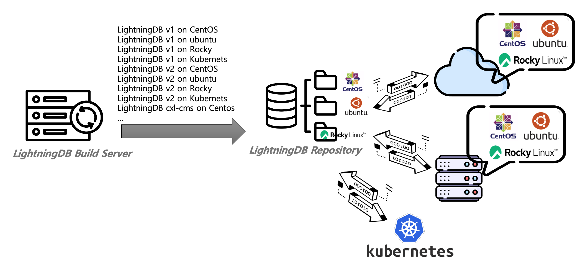
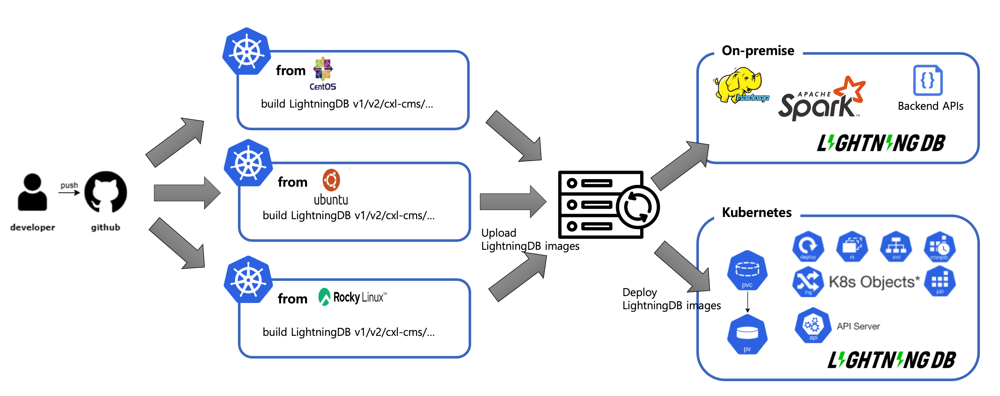

# Why Kubernetes?

### Legacy system
- As we work with multiple companies/organizations, deployment environments have diversified to cloud, Kubernetes, on-premise, etc. and OS requirements have also diversified, requiring us to be agile and responsive.

### On Kubernetes
- We built these environments to help you create versions in a consistently optimized environment across different environments.

